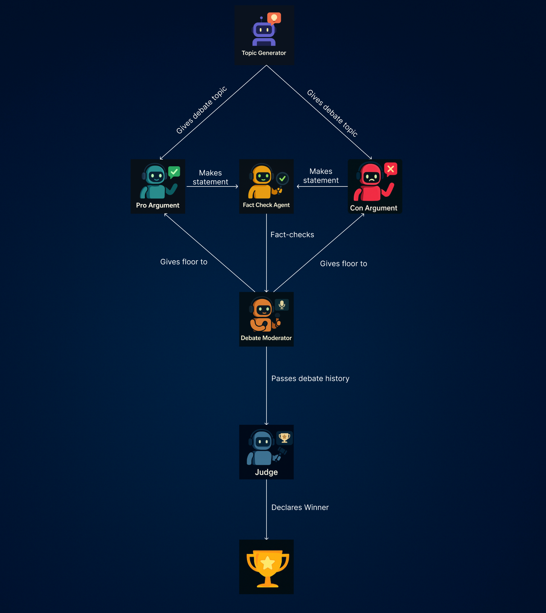

# deb8flow: Multi-Agent Debate Simulation with LangGraph

**deb8flow** is a full-stack, multi-agent AI debate framework built with [LangGraph](https://github.com/langchain-ai/langgraph). It simulates a structured and fact-checked formal debate between two autonomous AI agents — one PRO and one CON — orchestrated by a moderator and finalized with a judge's verdict.

This project showcases complex agentic flows, runtime control logic, fact verification, and dynamic decision-making in a fully controlled LangGraph workflow. If you're exploring how to build serious multi-agent systems with memory, routing, retries, and arbitration, **deb8flow** is your guide.

---

## Features

- **Dynamic Multi-Agent Debate Flow**  
  PRO vs CON debaters exchange structured arguments, rebuttals, counters, and final remarks.

- **LLM-Powered Agents**  
  Built using OpenAI’s GPT-4.1 (with web search) and LangChain runtimes.

- **Fact Checker Agent**  
  Validates claims using OpenAI's integrated web search; enforces accuracy with retry logic and disqualification if falsehoods persist.

- **Moderator & Router Nodes**  
  Uses `Command` objects to orchestrate debate flow and enforce stage transitions.

- **Judge Agent**  
  Concludes the debate with a verdict based on clarity, structure, and persuasive merit.

- **Fully Modular LangGraph Architecture**  
  Clean separation of nodes: topic generator, debaters, fact checker, routers, and judge.

---


## Flow




## Debate Flow Overview

- **Topic Generator**: Produces a nuanced, debatable topic for the session.

---

### Opening Phase
- **Pro Agent**: Delivers the **opening statement** in support of the topic.
- **Moderator**: Passes the floor to the **Con Agent**.
- **Con Agent**: Responds with a **rebuttal** to the Pro’s opening statement.

---

### Counter Phase
- **Moderator**: Returns the floor to the **Pro Agent**.
- **Pro Agent**: Offers a **counterargument** to the Con Agent's rebuttal.

---

### Closing Phase
- **Moderator**: Passes the floor to the **Con Agent** again.
- **Con Agent**: Presents their **final closing statement**.
- **Moderator**: Wraps up and hands off to the **Judge Agent**.

---

## Fact-Checker Agent Rules

- After **every speaker**, the Fact Checker **evaluates each claim** for accuracy.
- If a statement **fails the fact-check**, the speaker must **restate** or **correct** their argument.
- Any debater who fails **three fact-checks** automatically **loses** the debate.

---

## Judging Criteria

- The **Judge Agent** reviews the full debate history and evaluates both sides based on:
  - Argument **quality**
  - Logical **clarity**
  - Structural **coherence**
- The most persuasive, well-reasoned side **wins**.


## Installation & Usage

1) Clone the repository:

git clone https://github.com/iason-solomos/Deb8flow.git

cd deb8flow

2) Install Dependencies

pip install -r requirements.txt

3) Set up your .env file

Should include those keys:

OPENAI_API_KEY

and optionally (but recommended) for tracing:

LANGCHAIN_API_KEY

LANGCHAIN_TRACING_V2

LANGCHAIN_PROJECT

4) Run the debate

python main.py

5) [View example output, which includes a fact-check.](./examples/example_output.txt)

## Project Structure

```markdown
deb8flow/
├──configurations/             # Debate constants and LLM configs
├──nodes/                     # LangGraph nodes (debater, fact checker, etc.)
├──prompts/                   # System and human prompts per agent                 
├──tests/                      # Tests
├──workflow/                   # Langgraph workflow
├──debate_state.py            # Typed state definitions (DebateState, DebateMessage)
├──main.py                    # Entry point to run the debate
├──README.md
├──requirements.txt
├──utils.py                    # Some common utilities like getting the debate history
└──workflow_graph.png
```

## Built with:

[LangGraph](https://langchain-ai.github.io/langgraph/tutorials/introduction/) <br/>

[LangChain](https://python.langchain.com/docs/introduction/) <br/>

OpenAI GPT-4.1

Python 3.10+

Pydantic

dotenv

## Use Cases

Argument Generation or Position Testing

Fact Checking + Self-Correction Pipelines

Multi-Agent Workflow Demos

LangGraph Pattern Reference

AI Safety / Alignment Experiments

## Future Ideas
Add scoring by a panel of judges and decide winner based on majority voting

Add multiple debate rounds or crossfire

Export debate timeline to Markdown or HTML

## Contributing
Want to add a new node, logic layer, or feature? PRs welcome!

## Fork the repo

Create your branch: git checkout -b feature/your-feature

Commit your changes

Push and open a pull request

## License
MIT License.
© 2025 [Iason Solomos]

## 🌟 Show Your Support
If you find this useful, star the repo ⭐ and share it with your LangChain, LLM, or AI dev friends!